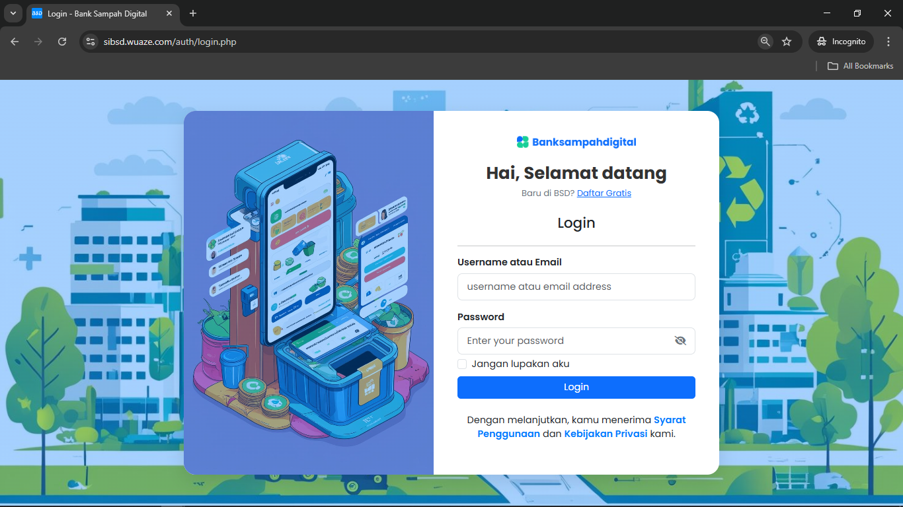
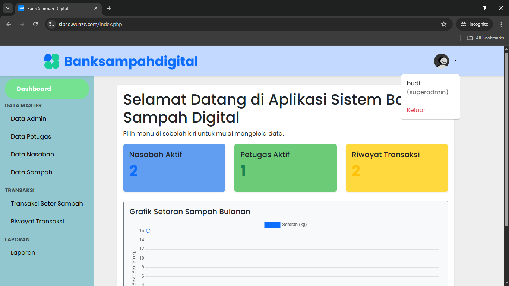
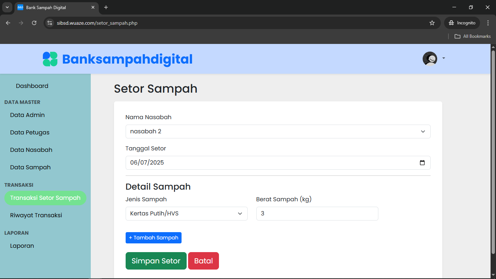
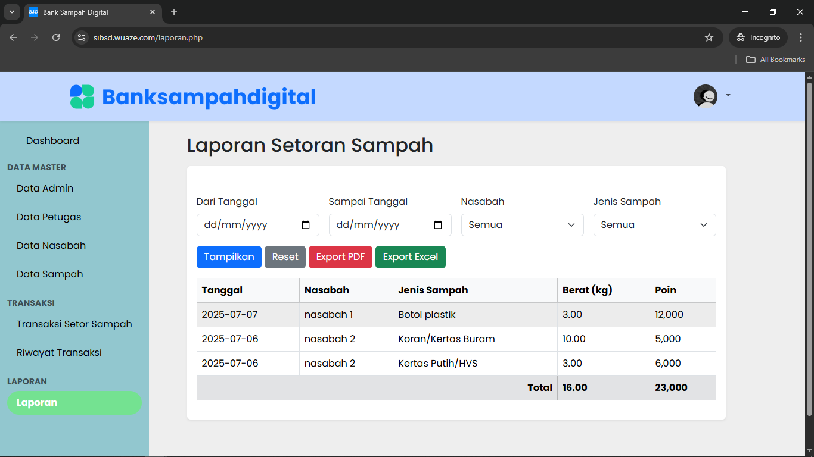
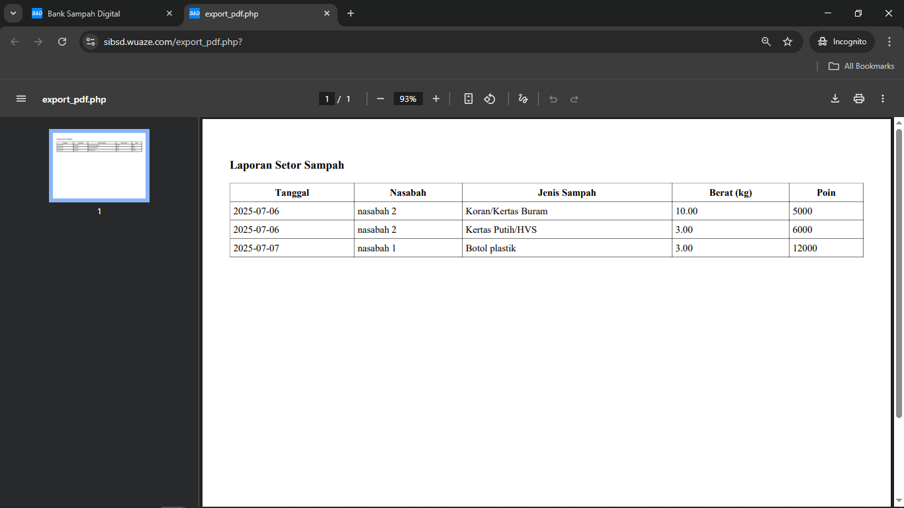

# ♻️ Sistem Bank Sampah Digital

> _Aplikasi manajemen sampah berbasis website untuk mendukung pengelolaan lingkungan yang berkelanjutan._

---

## 📌 Deskripsi

**Sistem Bank Sampah Digital** adalah aplikasi web berbasis **PHP Native**, **Bootstrap 5**, dan **JavaScript**.  
Dikembangkan sebagai proyek **UTS dan UAS** untuk mata kuliah **Pemrograman Aplikasi Berbasis Website**, aplikasi ini membantu lembaga atau komunitas dalam:

- Mencatat setoran sampah dari nasabah
- Mengelola data petugas, nasabah, dan jenis sampah
- Memonitor saldo poin dan transaksi
- Mencetak laporan ke PDF dan Excel

---

## 🚀 Demo Langsung

🔗 **Live Preview**: [https://sibsd.wuaze.com/](https://sibsd.wuaze.com/)

### 👤 Login Akun Uji Coba
| Role    | Username | Password    |
|---------|----------|-------------|
| Petugas | petugas  | petugas123  |

---

## 🎯 Fitur Unggulan

| Modul         | Fitur                                                                 |
|---------------|-----------------------------------------------------------------------|
| 🧑‍💼 **Admin/Petugas** | CRUD data petugas, nasabah, dan jenis sampah                        |
| ♻️ **Transaksi**      | Input setoran sampah (multi jenis), hitung poin otomatis         |
| 📄 **Riwayat**        | Lihat histori setoran dengan total poin & berat                 |
| 📊 **Laporan**        | Filter laporan per periode, jenis sampah, nasabah + Export PDF/Excel |
| 📈 **Dashboard**      | Statistik total nasabah, transaksi, dan grafik setoran bulanan |

---

## 📷 Screenshot Tampilan

### 🔹 Dashboard

### 🔹 Form Transaksi Setor Sampah

### 🔹 Laporan & Ekspor

---

## 🛠️ Teknologi Digunakan

- ✅ PHP Native
- ✅ Bootstrap 5.3
- ✅ JavaScript (jQuery)
- ✅ Chart.js (untuk grafik)
- ✅ MySQL
- ✅ PhpSpreadsheet (export Excel)
- ✅ Dompdf (export PDF)

---

## 🤝 Kontak dan Kontribusi

📧 Jika Anda memiliki pertanyaan, saran, atau ingin berkolaborasi:

- 🌐 **GitHub**: [@fjeer](https://github.com/fjeer)
- 📸 **Instagram**: [@jer.seven](https://instagram.com/jer.seven)
- 💼 **LinkedIn**: [fjeer](https://linkedin.com/in/fjeer)

---

> 💚 Terima kasih telah mengunjungi proyek ini. Jangan lupa ⭐ repo ini jika bermanfaat!

